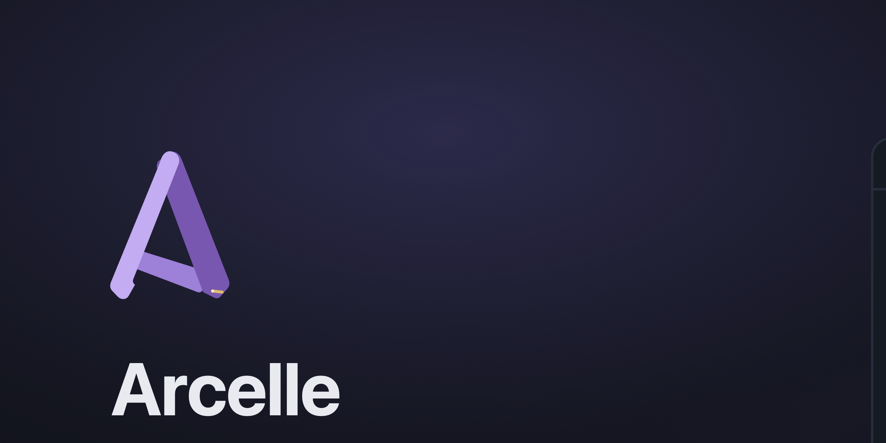

# Private Room



<p align="center">
  <a href="https://github.com/benrben/private-room/releases/latest"></a>
  
  
  
  
  
</p>

<p align="center"><b>A private AI workspace that lives inside a single file.</b><br>
Double-click it, unlock it with your password, and everything — your files,
your chats, the AI's memory — is sealed in <b>one encrypted document</b>.<br>
Nothing leaves your Mac unless you say so.</p>

---

A `.roomai` file works like a document. Double-click it in Finder, unlock it
with your password (or a fingerprint), and you're inside a private workspace
containing your files, chat history, AI memory, and generated documents.
Everything lives in **one SQLCipher-encrypted SQLite file** — copy it, back it
up, or AirDrop it like any other document. By default nothing leaves your
computer: the AI runs locally through Ollama.

## Why it's different

- 🔐 **One encrypted file, no cloud.** The whole workspace is a single
  AES-256 SQLCipher document. No account, no sync, no server. Your password is
  the key — lose it and not one byte is recoverable.
- 🖥️ **The AI runs on your Mac.** A local model answers, sees your images,
  and *drives the app* — opening files, editing text, highlighting quotes,
  marking up images. Cloud is opt-in and always labeled.
- 🎙️ **Everything on-device.** Encryption, Touch ID, OCR for scans, and
  speech-to-text all run locally using the model weights and macOS frameworks
  already on your machine.
- 🪶 **Tuned for a small model.** Built to be reliable on a 4B local model —
  constrained decoding, deterministic tool routing, and honest "I can't do
  that in place" behavior instead of confident nonsense. See
  [Engineered for a 4B model](#engineered-for-a-4b-model).

## What's in a room

| | |
|---|---|
| **Files** | PDFs, Office docs, spreadsheets, Markdown, code, images, audio & video — stored as encrypted blobs, previewed with real viewers, organized into folders |
| **Chat** | Streaming conversations with the room's AI, grounded in your files; any reply can be saved back into the room as a new document |
| **Memory** | Facts the AI should always remember, editable in the sidebar — the AI can add its own |
| **Settings** | Per-room model, creativity (temperature), custom instructions, Touch ID, dictation, and online features |

## The AI lives in the room

The model isn't a chat box bolted on the side — it can act on the room.

- 👁️ **It can see.** Attach an image with the paperclip and ask about it.
  *"Where is X?"* draws labeled boxes on the image; grounding auto-routes to a
  Qwen-VL model when one is installed (measured: far more accurate boxes than
  the chat model). Images are transcoded to PNG and downscaled before
  inference, so formats Ollama can't decode just work.
- 🕹️ **It can drive the app.** The model has tools — `search_room`,
  `list_room_files`, `open_file` (jumps to a page, cell, or phrase),
  `mark_image`, `annotate_file`, `create_file`, `edit_file`, `set_cells`,
  `add_memory` — so *"open the budget spreadsheet at Q3"*, *"mark the signature
  in this scan"*, or *"fix the typo in my notes"* actually happen in the UI.
- ✏️ **It can edit files.** Exact-text replacement in text, code, CSV and DOCX
  (run-aware XML editing preserves Word formatting), full rewrites of text
  files, and cell edits in `.xlsx`/`.csv` by A1 reference. PDFs are honest: not
  editable in place — the AI highlights or saves a corrected copy instead.
  Every edit re-indexes the file and saves a restorable **version**.
- 📍 **It can point at things.** Beyond image boxes, `annotate_file` highlights
  an exact quote in PDFs (drawn over the page), DOCX and Markdown (CSS Custom
  Highlight API), or a cell range in spreadsheets. The model must quote
  verbatim — the app verifies it before marking, anchors to the closest match
  if it's slightly off, and each reply carries a 📍 chip that re-opens the
  highlight.
- 🧠 **It remembers.** Room memory is a short list of facts the AI is always
  given. You edit it in the sidebar; the model can append to it with
  `add_memory` or `#remember`.
- 🔎 **It retrieves.** Imported files are chunked and keyword-scored; the best
  excerpts travel with your question, and sources are shown on each answer.
  (An embeddings column is already reserved for vector search.)

### Chat commands

Type `#` in the composer for quick, deterministic workflows — no coaxing the
model into the right shape:

| Command | What it does |
|---|---|
| `#add-file` | Write a new note or document — or one per item with "for each" |
| `#find` | Search the room's files and list what matches |
| `#highlight` | Mark an exact passage in a file so you can see it in the viewer |
| `#extract` | Pull the same fields out of several files into a spreadsheet |
| `#summarize` | Summarize the whole room, or one `@file` |
| `#compare` | Compare two or more `@files` side by side |
| `#to-sheet` | Turn the table in the last answer into a spreadsheet |
| `#transcribe` | Show the transcript of an `@recording` |
| `#minutes` | Turn a `@recording`'s transcript (or notes) into timeline-style HTML minutes |
| `#translate` | Translate an `@file` into another language |
| `#remember` | Save a fact to the room's permanent memory |

## On-device by default

Everything that touches your data runs on your Mac, using capabilities that are
already there.

- **Encryption.** Your password is the SQLCipher key (PBKDF2-derived
  internally). A wrong password can't read a single byte; there is no recovery,
  no reset link, no backdoor.
- **Touch ID unlock.** Opt in per room and unlock with a fingerprint. The
  password is sealed in the macOS Keychain behind a `biometryCurrentSet`
  access control — it never touches the room file or any plain file, and
  re-enrolling a finger invalidates it. The password field is always still
  there as a fallback.
- **OCR for scans.** When a PDF or image has no extractable text, Apple's
  Vision framework recognizes it (English + Hebrew) entirely on-device — no
  bundled engine, nothing over the network. Best-effort: if it can't, import
  quietly falls back to "no text."
- **Dictation & transcription.** A Whisper engine is *compiled into* the app
  (whisper.cpp on Metal) — only the model weights download on first use, one
  deletable file. Record voice messages, dictate into the composer, or drop in
  an audio/video file and get an on-device transcript. Optionally have the
  local model clean up or translate what you said. Decoding uses tools that
  ship with macOS (`afconvert`/`avconvert`) — no ffmpeg, no Python.
- **Web is off until you ask.** The search tools aren't even offered to the
  model until you pick a provider in **Settings → Online features**. DuckDuckGo
  works free with no key or account; a SearXNG instance you trust is the
  self-hosted option. Fetches run in Rust behind a private-network guard,
  results are clamped to fit a small context, and pages are cached in the room.
- **Optional cloud engines.** If the Claude Code or Codex CLI is installed, it
  appears in Settings as an engine choice. The UI is blunt: cloud engines send
  your questions and room context to *your own* account — images never leave,
  and vision/marking always stays local.

## Files, viewers & organization

Imported files are stored as encrypted blobs and previewed with real viewers —
all bundled locally, no CDN, no network fetch.

| Format | Viewer / editing |
|---|---|
| PDF | PDF.js page renderer with quote highlighting |
| DOCX | docx-preview (run-aware AI edits keep formatting) |
| XLSX / CSV | SheetJS grid with sheet tabs; edit cells by A1 reference |
| Markdown / HTML | Rendered view with an edit toggle; generated docs are self-contained HTML in a sandboxed viewer |
| Code / text | Monaco editor — ⌘S saves back into the room and re-indexes |
| Images | Zoomable viewer with a "locate" bar for visual grounding |
| Audio / video | On-device transcript via the built-in Whisper engine |

- **Folders.** Group files into collapsible folders; drag a file onto a folder
  (or the Files header) to move it. Delete a folder and its files return to the
  top level — nothing is lost.
- **Version history.** Every edit or restore keeps the previous version (last
  10) with a cause and timestamp. Restore brings the old bytes back exactly —
  even for binary `.xlsx` cells — and history survives lock/reopen.
- **Import a link.** Paste a URL and Private Room fetches the page once, saves a
  readable offline copy into the room, and the AI can answer from it with the
  web still off.
- **Export.** Export any file (byte-identical for originals) or the whole room;
  a one-time notice reminds you that copies leave the encrypted vault.

## How it works

```
  ┌─ .roomai ────────────────────────────────────────────────┐
  │  SQLCipher (AES-256) · files · chats · memory · versions  │
  └───────────────────────────────────────────────────────────┘
        ▲ password / Touch ID unlocks the key
        │
   create ─▶ import ─▶ extract text ─▶ chunk + index
                          (OCR / Whisper fallback)      │
                                                        ▼
   ask ─▶ score chunks ─▶ best excerpts + tools ─▶ local model ─▶ answer
                                                        │
                                          acts on the room ─┘
   generate ─▶ "Save to room" ─▶ indexed like any other file
```

1. **Create / unlock** — your password is the SQLCipher key. A wrong password
   can't read a single byte; there is no recovery.
2. **Import** — files are stored as encrypted blobs; readable text is extracted
   by built-in Rust extractors (PDF, DOCX, XLSX, HTML, Markdown, code, CSV,
   plain text), with on-device OCR / Whisper as fallbacks for scans and audio,
   and Microsoft's MarkItDown for exotic formats when installed
   (`pipx install markitdown`).
3. **Ask** — your question is scored against every chunk in the room, the best
   excerpts are sent to the model, tools let it act on the room, and both sides
   of the chat are saved inside the file.
4. **Generate** — any assistant reply can be saved back into the room, where
   it's indexed like any other file. New documents default to self-contained
   HTML pages.

## Engineered for a 4B model

Private Room targets a 4B local model on a 16 GB Mac — small enough to run
comfortably, small enough to wander. So judgment lives in deterministic Rust,
not in the model's good intentions:

- **Constrained decoding.** Grounding boxes, field extraction, room summaries,
  and file lists are produced with a JSON schema (`format`), so the output
  *can't* be malformed — no salvage parsers.
- **Deterministic tool routing.** A keyword router picks the smallest tool
  subset for each turn (file-mutating tools are withheld unless the ask calls
  for them), and the chosen "lane" is shown in the UI.
- **RAM-aware context.** The context window is capped small by default so a
  model that declares a 256K window can't OOM the machine; Macs with ≥32 GB get
  a larger window automatically.
- **Honest failure & teaching errors.** PDFs aren't faked as editable; a
  near-miss quote anchors to the closest match and says "≈ closest match"; a
  not-found file returns the actual file list so the next attempt lands.
- **Cache-stable prompts.** The system prompt is kept KV-cache-stable
  (per-question memories move into the user message) so warm replies stay fast.

## Download

**[⬇︎ Download the latest DMG](https://github.com/benrben/private-room/releases/latest)** — macOS 12 or later, Apple Silicon.

1. Open the `.dmg` and drag **Private Room** into **Applications**.
2. This build is ad-hoc signed (**not notarized**), so the first time you open
   it macOS warns *"Apple could not verify 'Private Room' is free of malware…"*
   That's expected for an un-notarized app — the full source is in this repo.
   Clear the download quarantine once, then open it normally:

   ```sh
   /usr/bin/xattr -cr "/Applications/Private Room.app"
   ```

   (Use the full path `/usr/bin/xattr` — a Python `xattr` on your PATH, e.g. from
   pyenv, has no `-r` flag and fails with *"option -r not recognized"*.)

   Rather not use Terminal? Double-click the app, click **Done** on the warning,
   then open **System Settings → Privacy & Security**, scroll to **Security**,
   and click **Open Anyway** next to "Private Room" (you'll confirm once more).
3. Install the local AI engine — **Ollama** — and start it (the app talks to it
   on `localhost:11434`):

   ```sh
   brew install ollama            # or get it from https://ollama.com
   ollama serve &                 # skip if the Ollama menu-bar app is running
   ```

   On first launch Private Room shows a **model picker** — choose one (e.g.
   `qwen3.5:4b`, ~3.4 GB) and it downloads with a progress bar, no Terminal
   needed. Dictation and OCR need nothing extra (the Whisper weights download on
   first use), and you can add more models anytime in **Settings → Model
   manager**.

Prefer to build it yourself? See [Development](#development).

## Development

```sh
npm install
npm run tauri dev     # run the app
npm run tauri build   # build Private Room.app + DMG (registers .roomai)
cd src-tauri && cargo test   # encryption, extraction, routing tests
npm run e2e           # headless end-to-end smoke test (mock model, no network)
```

Requires: Rust, Node, and [Ollama](https://ollama.com) with a model pulled
(`ollama pull qwen3.5:4b`) — or pull it from inside the app via Settings →
Model manager. Dictation and OCR need no extra install; the Whisper weights
download on first use.

**Stack:** Tauri 2 (Rust) · React 19 + TypeScript · SQLCipher (AES-256) ·
Ollama · whisper.cpp · Apple Vision.

Related docs: [RELEASING.md](RELEASING.md) (signing & notarization),
[TESTING.md](TESTING.md) (the QA mission), [e2e/](e2e/README.md) (smoke test),
[art/](art/README.md) (brand assets).

## Design

The brand is a violet keyhole-doorway on ink — private, sealed, calm.

| Token | Hex | Role |
|---|---|---|
| Ink | `#0e1014` | Backgrounds |
| Panel | `#161a22` / `#1c212c` | Surfaces |
| Border | `#262d3b` | Strokes and dividers |
| Text / Slate | `#e8eaf0` / `#8b93a7` | Foreground / secondary |
| **Violet** | **`#8b7cf6`** | The accent — keyholes, glows, focus |
| Green / Amber / Red | `#4cc38a` / `#e3b341` / `#e5646c` | Status only |

In-app icons are React components in [`src/icons.tsx`](src/icons.tsx); master
artwork and the asset-generation pipeline (app icon, `.roomai` document icon,
DMG background, this README's banner and badges) live in
[`art/`](art/README.md).

## Roadmap

Shipped since the first cut:

- [x] Touch ID unlock (LocalAuthentication + Keychain-wrapped key)
- [x] Link import with offline page archiving
- [x] On-device OCR for scanned documents (Apple Vision)
- [x] On-device dictation & transcription (Whisper)
- [x] Folders, version history, and room export

Next:

- [ ] Embedding-based retrieval (sqlite-vec)
- [ ] In-place `.xlsx` editing beyond single cells, and DOCX export
- [ ] Windows port (Tauri)
- [ ] Touch ID for signed release parity on all edit paths
