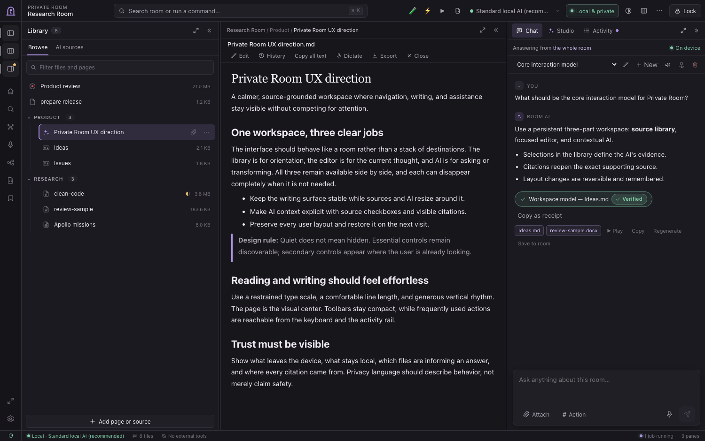
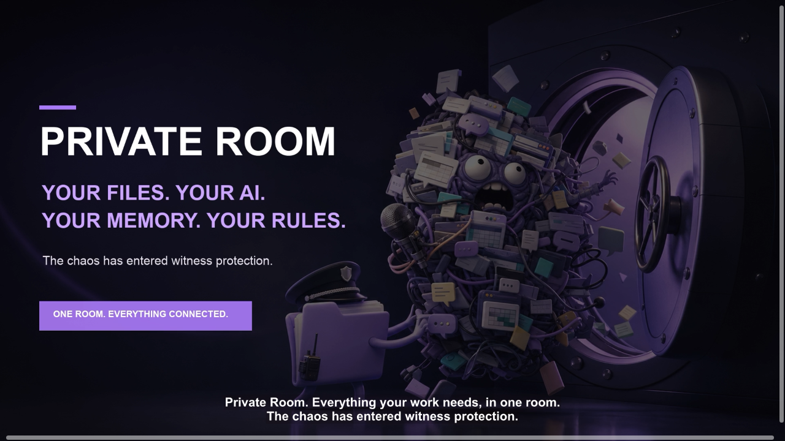
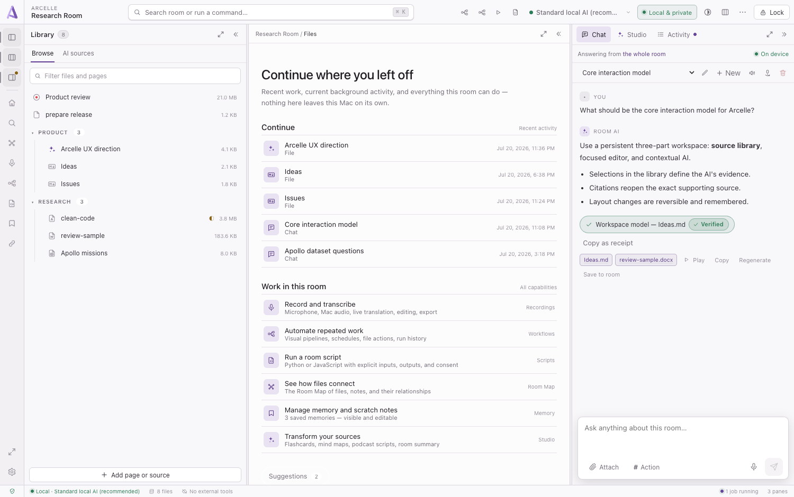
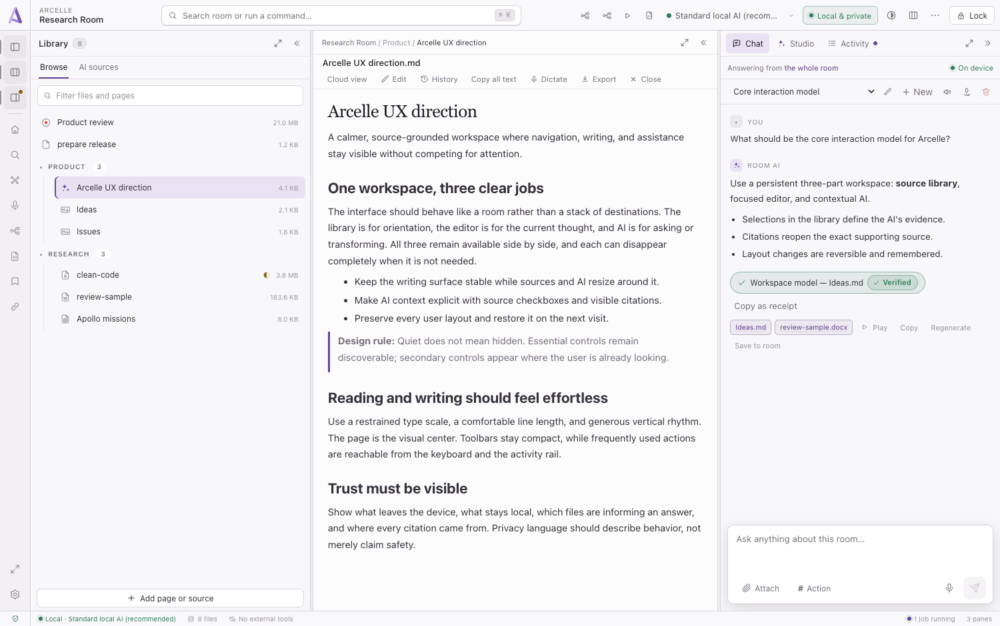
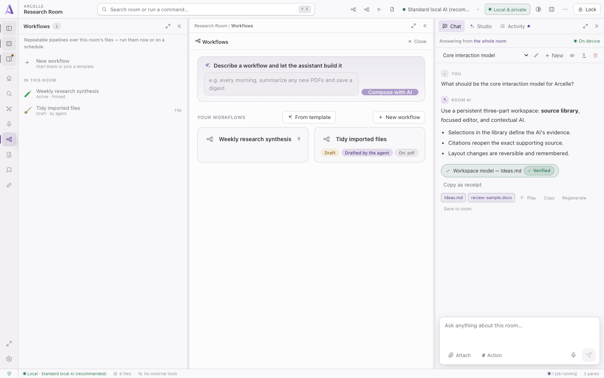
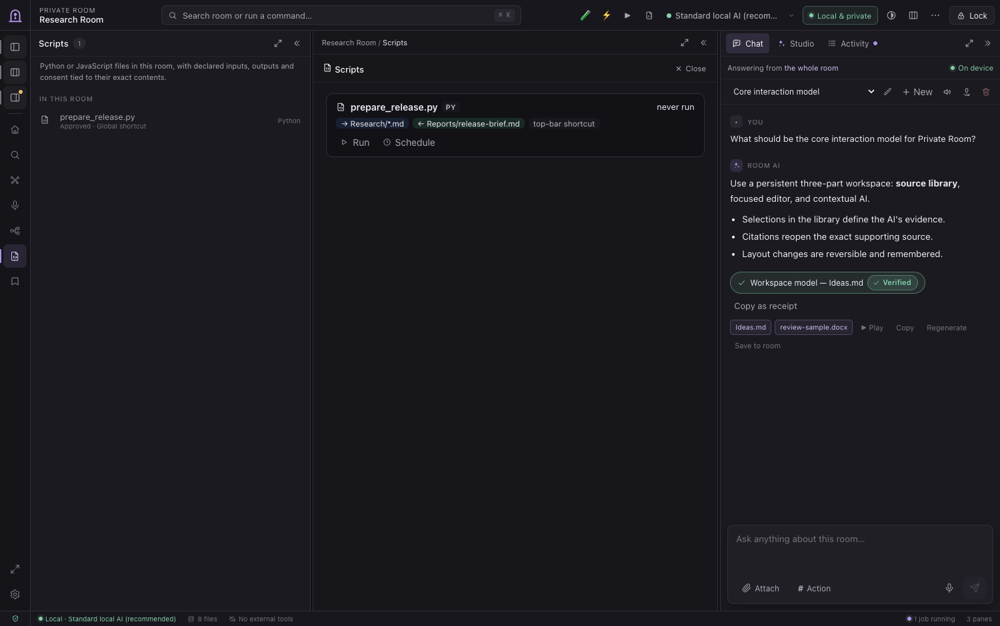
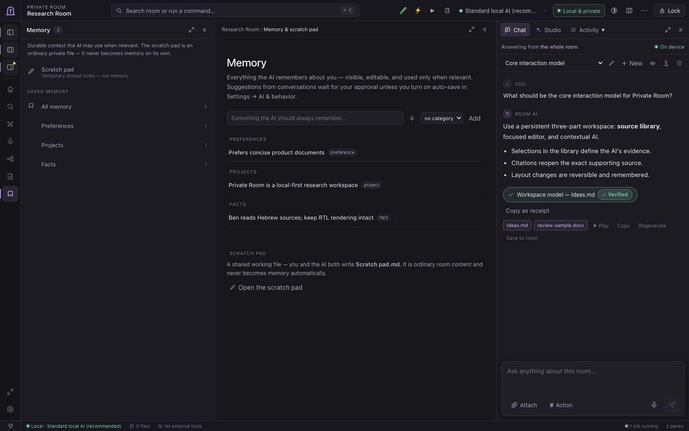
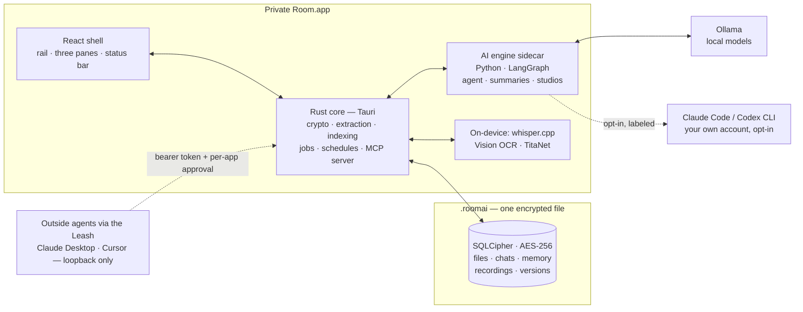

# Private Room


<p align="center">
  <a href="https://github.com/benrben/private-room/releases/latest"></a>
  
  
  
  
  
</p>

<p align="center"><b>A private AI workspace that lives inside a single file.</b><br>
Double-click it, unlock it with your password, and everything — your files,
your chats, the AI's memory — is sealed in <b>one encrypted document</b>.<br>
Nothing leaves your Mac unless you say so.</p>



<p align="center">
  <a href="https://github.com/benrben/private-room/raw/main/art/private-room-productivity-witness-protection.mp4"></a><br>
  <b>🎬 Watch the video (74 s)</b> — <i>one job, seven apps… until the chaos enters witness protection.</i>
</p>

---

A `.roomai` file works like a document. Double-click it in Finder, unlock it
with your password (or a fingerprint), and you're inside a private workspace
containing your files, chat history, AI memory, recordings, and generated
documents. Everything lives in **one SQLCipher-encrypted SQLite file** — copy
it, back it up, or AirDrop it like any other document. By default nothing
leaves your computer: the AI runs locally through Ollama — and if you *choose*
to point a room at a cloud engine, the app says so out loud, everywhere.

## Why it's different

- 📍 **A local AI that can't fake a citation.** Every claim is pinned to the
  exact sentence in your document — and the app *verifies the quote before it
  shows it.* If the words aren't really there you get "≈ closest match" or
  nothing at all, never a confident invention. Each answer carries a 📍 chip
  that re-opens the highlight right in the file.
- 📤 **AirDrop your whole workspace as one file.** A room is a single document,
  so handing someone an entire encrypted workspace — files, chats, memory, and
  all — is one drop of one `.roomai` file. Seal it and send it; nothing is left
  behind on a server.
- 🔐 **One encrypted file, no cloud.** The whole workspace is a single AES-256
  SQLCipher document. No account, no sync, no server. Your password is the key
  — no backdoor, no cloud reset. (When you create a room you can print a
  one-time recovery key to keep somewhere safe.)
- 🔁 **It works while you don't.** Workflows chain AI steps into pipelines that
  run on a schedule; room scripts are real Python/JavaScript files that run
  against your files with explicit consent; studios turn sources into
  flashcards, mind maps, and podcast scripts — all as cancellable background
  jobs.
- 🎙️ **It listens on-device.** Record your mic *and* the meeting's system
  audio, watch a live transcript build with speakers told apart automatically,
  and keep the whole thing — audio, transcript, speakers — inside the encrypted
  file.
- 🪶 **Tuned for a small model.** Built to be reliable on a 4B local model —
  constrained decoding, deterministic tool routing, and honest "I can't do
  that in place" behavior instead of confident nonsense. See
  [Engineered for a 4B model](#engineered-for-a-4b-model).

## One shell, three panes

The window is a persistent workspace, not a stack of screens. An activity rail
walks the room's areas — Home, Room Map, Recordings, Workflows, Scripts,
Memory, Settings — while the workspace splits into three draggable panes:
**Library** (your sources), **Workspace** (the current document), and **AI**
(Chat, Studio, and a live Activity feed). A status bar always tells the truth:
which engine is answering, whether it's local or cloud, what's running in the
background, and what's waiting for your approval. `⌘K` is both room search and
a command palette that runs real app commands.



Dark is the default; a full light theme ships too, and every color in the app
flows through one token system so both are first-class.



## What's in a room

| | |
|---|---|
| **Files** | PDFs, Office docs, spreadsheets, Markdown, code, images, audio & video — stored as encrypted blobs, previewed with real viewers, organized into folders |
| **Chat** | Streaming conversations with the room's AI, grounded in your files; any reply can be saved back into the room as a new document |
| **Recordings** | Live meeting capture (mic + system audio) with real-time transcription and automatic speaker identification |
| **Workflows** | Visual multi-step AI pipelines with schedules, run history, and per-step artifacts |
| **Scripts** | Runnable Python/JavaScript files with declared inputs and outputs, schedulable like workflows |
| **Memory** | Everything the AI remembers about you — a full area with categories, approval flow, and a shared scratch pad |
| **Studio** | Flashcards, mind maps, podcast scripts, and a living room summary, generated as background jobs |
| **Settings** | Per-room engine and model, creativity, custom instructions, role, Touch ID, dictation, and online features |

**Start from a template.** A new room can begin **Blank**, or as **Legal**,
**Medical**, **Research**, or **Journal** — each pre-fills tuned instructions, a
few starter memories, and a welcome note. It's all ordinary, editable content;
nothing is locked in.

## The AI lives in the room

The model isn't a chat box bolted on the side — it can act on the room.

- 👁️ **It can see.** Attach an image with the paperclip and ask about it.
  *"Where is X?"* draws labeled boxes on the image; grounding auto-routes to a
  Qwen-VL model when one is installed. Images are transcoded and downscaled
  before inference, so formats Ollama can't decode just work — and images
  never leave the Mac, even on a cloud engine.
- 🕹️ **It can drive the app.** The model has tools — `search_room`,
  `list_room_files`, `open_file` (jumps to a page, cell, or phrase),
  `mark_image`, `annotate_file`, `create_file`, `edit_file`, `edit_files`,
  `set_cells`, `add_memory` — so *"open the budget spreadsheet at Q3"*,
  *"mark the signature in this scan"*, or *"fix the typo in my notes"*
  actually happen in the UI.
- ✏️ **It can edit files — reliably.** Exact-text replacement with a
  normalization layer (curly quotes, NBSP, CRLF, dash variants) that tolerates
  cosmetic drift but still demands a unique match — a miss fails safely with a
  closest-snippet hint instead of editing the wrong place. The atomic
  `edit_files` tool validates a whole multi-file batch (including renames with
  reference updates) before writing any of it, undoable as a group. Prefer to
  look first? Flip on **ask before AI edits** and approve each batch from a
  side-by-side diff.
- 📍 **It can point at things.** `annotate_file` highlights an exact quote in
  PDFs, DOCX, and Markdown, or a cell range in spreadsheets. The model must
  quote verbatim — the app verifies it before marking (in any language,
  including pointed Hebrew against unpointed quotes), anchors to the closest
  match if it's slightly off, and each reply carries a 📍 chip that re-opens
  the highlight.
- 🧠 **It remembers — with your approval.** Memory suggestions from
  conversations wait for a yes by default (or flow in automatically if you
  opt in), and everything it knows is visible and editable in the Memory area.
- 🔎 **It retrieves.** Imported files are chunked, indexed automatically in
  the background, and keyword-scored; the best excerpts travel with your
  question, and sources are shown on each answer.

### Chat commands

Type `#` in the composer for quick, deterministic workflows — no coaxing the
model into the right shape:

| Command | What it does |
|---|---|
| `#add-file` | Write a new note or document — or one per item with "for each" |
| `#find` | Search the room's files and list what matches |
| `#highlight` | Mark an exact passage in a file so you can see it in the viewer |
| `#extract` | Pull the same fields out of several files into a spreadsheet |
| `#summarize` | Summarize the whole room, or one `@file` |
| `#compare` | Compare two or more `@files` side by side |
| `#to-sheet` | Turn the table in the last answer into a spreadsheet |
| `#transcribe` | Show the transcript of an `@recording` |
| `#minutes` | Turn a `@recording`'s transcript (or notes) into timeline-style HTML minutes |
| `#translate` | Translate an `@file` into another language |
| `#remember` | Save a fact to the room's permanent memory |

## One room, any engine

A room picks its engine once, and **every** AI feature honors it — chat, the
agent, summaries, deep file passes, AI actions, studios, suggestions, and
workflow steps. No feature quietly falls back to a different brain.

- **Standard local AI** (recommended) — Ollama on your Mac. The app even runs
  the daemon for you: it starts Ollama on demand and stops it after five idle
  minutes, and never touches a daemon you started yourself.
- **Ollama `:cloud` models** — labeled as cloud everywhere they appear, never
  "local," and excluded when a feature explicitly needs on-device generation.
- **Claude Code / Codex CLI** — if the CLI is installed, it shows up as an
  engine. Pick the exact model and reasoning effort from the top-bar picker
  (Codex's model catalog is read live from the CLI). Your questions and room
  context go through *your own* CLI account — and the room's tools ride along
  over a per-question localhost MCP bridge, so the cloud model can search and
  edit room files while decryption stays in-process. The bridge dies when the
  answer returns.

Four things intentionally stay on-device no matter the engine: dictation,
quick local generation, image grounding boxes, and the UI-driving tools.

### The Leash: let outside agents work in your room

Flip a switch and an unlocked room becomes a local MCP server that agents on
your Mac — Claude Code, Codex, Claude Desktop, Cursor — can connect to over
loopback with a bearer token. Choose **Files only** or **Full agent** (file
tools, background jobs, local generation, and media frames; UI control stays
excluded by design). Copy-paste config, per-app approval, and instant
revocation: regenerate the token or stop the server and live connections are
severed on the spot. Lock the room and their access dies with it.

## Automate the boring parts



- **Workflows** chain six kinds of steps — generate, summarize, deep
  full-file pass, run the agent, save a file, and condition branches — on an
  animated canvas that lights up node by node as a run executes. Start from a
  template (Morning digest, New-file summarizer, Weekly review, Deep read),
  build by hand, or **describe the workflow in plain language and let the
  room's model draft it**. Runs keep step-by-step history and artifacts.
- **Schedules that survive a locked room.** Interval, daily, or weekly
  (DST-safe), with an optional catch-up run at unlock for triggers missed
  while the room was locked. Consent is collected once at activation, and a
  new trigger is skipped — not queued into a pile-up — if the previous run is
  still going.
- **Scripts** make Python and JavaScript files in your room runnable: a Run
  button in the file header, a Scripts area with status, schedule, and full
  run history including stdout/stderr. Each run executes in an isolated
  workspace, reads room files in and writes results back as versioned,
  undoable room files, and is gated by a first-run approval that must be
  re-granted if the script's content changes. Dependencies install themselves
  via `uv` — declared in a PEP-723 block, or detected and installed on the
  fly when a bare `import pandas` fails.
- **Studios run in the background.** Flashcards, mind maps, and podcast
  scripts enqueue as cancellable jobs, progress lives on the sidebar job card,
  and the finished page opens when it's ready. Jobs queue FIFO instead of
  refusing to start while another is running.



## Record the meeting, keep the proof

Record your microphone plus the Mac's system audio (ScreenCaptureKit) and
watch the transcript build live as people speak — with speakers told apart
automatically by on-device TitaNet voice embeddings, color-coded chips per
speaker, live translation, and pause/resume. Afterwards, edit the recording by
editing its transcript, or re-transcribe old recordings with the current
pipeline. If the app dies mid-recording, checkpoints are spliced back together
the next time the room opens — nothing recorded is lost. Everything stays in
the encrypted file.

## Memory you can see



Everything the AI remembers about you is a first-class area: browse, add,
edit, and delete memories grouped by category (Instructions, Preferences,
Projects, Facts), with suggestions from conversations waiting for your
approval unless you opt into auto-save. A pinned **scratch pad** is one click
away — a canonical, versioned room file that you and the AI both write, with a
reconcile banner instead of silent clobbering when you both edit at once.

## On-device by default

Everything that touches your data runs on your Mac, using capabilities that
are already there.

- **Encryption.** Your password is the SQLCipher key (PBKDF2-derived
  internally). A wrong password can't read a single byte; there's no backdoor
  and no cloud reset — the only other way in is a recovery key you chose to
  print when you created the room. Changing your password re-wraps the
  recovery code (the old one stops working, and the app shows you the new
  one).
- **Touch ID unlock.** Opt in per room and unlock with a fingerprint. The
  password is sealed in the macOS Keychain behind a `biometryCurrentSet`
  access control — it never touches the room file or any plain file, and
  re-enrolling a finger invalidates it.
- **Checkpoints.** Snapshot the whole room — like a git commit for your
  `.roomai` — and roll back to any of them. Rollback takes a "before
  rollback" safety copy first and refuses to run while jobs or recordings are
  in flight.
- **OCR for scans.** When a PDF or image has no extractable text, Apple's
  Vision framework recognizes it (English + Hebrew) entirely on-device.
  Visual-order Hebrew PDFs — the ones that extract as mirrored gibberish
  everywhere else — are detected and repaired at import, vowel points and
  all.
- **Dictation & transcription.** A Whisper engine is *compiled into* the app
  (whisper.cpp on Metal) and the release DMG **ships the voice model**, so
  transcription works offline the moment you open it — no download.
- **Web is off until you ask.** Search tools aren't even offered to the model
  until you pick a provider in **Settings → Online features**. Fetches run in
  Rust behind a private-network guard (CGNAT, multicast, reserved ranges, and
  IPv4-mapped-IPv6 tricks included), responses are capped at 8 MB, and pages
  are cached in the room.
- **Honest privacy labels.** The status bar and engine picker always show
  what's local and what leaves the Mac; cloud is opt-in and labeled at the
  moment of choice, not buried in settings.

## Files, viewers & organization

Imported files are stored as encrypted blobs and previewed with real viewers —
all bundled locally, no CDN, no network fetch.

| Format | Viewer / editing |
|---|---|
| PDF | PDF.js renderer — full documents of any length, lazily rendered, with quote highlighting |
| DOCX | docx-preview (run-aware AI edits keep formatting) |
| XLSX / CSV | SheetJS grid with sheet tabs; edit cells by A1 reference |
| Markdown / HTML | Rendered view with an edit toggle; generated docs are self-contained HTML in a sandboxed viewer |
| Code / text | Monaco editor — ⌘S saves back into the room and re-indexes |
| Images | Zoomable viewer with a "locate" bar for visual grounding |
| Audio / video | On-device transcript via the built-in Whisper engine |

- **Folders.** Group files into collapsible folders; drag to organize. Delete
  a folder and its files return to the top level — nothing is lost.
- **Version history & compare.** Every edit keeps the previous version with a
  cause and timestamp. Open any version in a side-by-side diff against the
  current text (RTL-aware for Hebrew/Arabic documents) and restore from
  there — byte-exact, even for binary `.xlsx`.
- **Import a link.** Paste a URL and Private Room fetches the page once, saves
  a readable offline copy into the room, and the AI can answer from it with
  the web still off.
- **Export.** Export any file (byte-identical for originals) or the whole
  room; a one-time notice reminds you that copies leave the encrypted vault.

## How it works



1. **Create / unlock** — your password is the SQLCipher key. A wrong password
   can't read a single byte.
2. **Import** — files are stored as encrypted blobs; readable text is
   extracted by built-in Rust extractors, with on-device OCR / Whisper as
   fallbacks, then chunked and indexed automatically in the background.
3. **Ask** — your question is scored against every chunk in the room, the
   best excerpts are sent to the engine through the bundled AI sidecar, tools
   let it act on the room, and both sides of the chat are saved inside the
   file. One engine gateway serves every feature, so they all behave the
   same — and fail with the same honest errors.
4. **Generate** — any assistant reply can be saved back into the room, where
   it's indexed like any other file.

The sidecar binds to localhost only, never sees the room key, and is spawned,
health-checked, and shut down by the app. Its behavior is covered by 600+
tests across Rust and Python.

## Engineered for a 4B model

Private Room targets a 4B local model on a 16 GB Mac — small enough to run
comfortably, small enough to wander. So judgment lives in deterministic Rust,
not in the model's good intentions:

- **Constrained decoding.** Grounding boxes, field extraction, room summaries,
  and file lists are produced with a JSON schema (`format`), so the output
  *can't* be malformed — and cloud models that wrap JSON in fences get their
  answers recovered automatically.
- **Deterministic tool routing.** A keyword router picks the smallest tool
  subset for each turn (file-mutating tools are withheld unless the ask calls
  for them), and the chosen "lane" is shown in the UI.
- **RAM-aware context.** The context window is capped small by default so a
  model that declares a 256K window can't OOM the machine; Macs with ≥32 GB
  get a larger window automatically.
- **Honest failure & teaching errors.** PDFs aren't faked as editable; a
  near-miss quote anchors to the closest match and says "≈ closest match"; a
  not-found file returns the actual file list so the next attempt lands.
- **Cache-stable prompts.** The system prompt is kept KV-cache-stable so warm
  replies stay fast.

## Download

**[⬇︎ Download the latest DMG](https://github.com/benrben/private-room/releases/latest)** — macOS 12 or later, Apple Silicon.

1. Open the `.dmg` and drag **Private Room** into **Applications**.
2. This build is ad-hoc signed (**not notarized**), so the first time you open
   it macOS warns *"Apple could not verify 'Private Room' is free of malware…"*
   That's expected for an un-notarized app — the full source is in this repo.
   Clear the download quarantine once, then open it normally:

   ```sh
   /usr/bin/xattr -cr "/Applications/Private Room.app"
   ```

   (Use the full path `/usr/bin/xattr` — a Python `xattr` on your PATH has no
   `-r` flag.) Rather not use Terminal? Double-click the app, click **Done** on
   the warning, then **System Settings → Privacy & Security → Open Anyway**.
3. Install the local AI engine — **Ollama**:

   ```sh
   brew install ollama            # or get it from https://ollama.com
   ```

   That's it — the app starts and stops the Ollama daemon itself. On first
   launch Private Room shows a **model picker** — choose one (e.g.
   `qwen3.5:4b`, ~3.4 GB) and it downloads with a progress bar, no Terminal
   needed. Dictation, transcription, and OCR need nothing extra — the Whisper
   voice model is **bundled in the app**.

Prefer to build it yourself? See [Development](#development).

## Development

```sh
npm install
npm run tauri dev            # run the app
npm run tauri build          # build Private Room.app + DMG (registers .roomai)
cd src-tauri && cargo test   # Rust: encryption, extraction, routing (347 tests)
cd sidecar && pytest tests   # Python: the AI engine sidecar (415 tests)
npm run e2e                  # headless end-to-end smoke test (mock model)
npm run build && node qa/make-qa.mjs && npx vite preview
                             # → open /qa.html: full UI in a browser w/ mock IPC
```

Requires: Rust, Node, [uv](https://docs.astral.sh/uv/) (builds and runs the
Python sidecar), and [Ollama](https://ollama.com). Pull a model from inside
the app (Settings → Model manager) or `ollama pull qwen3.5:4b`. Release
builds bundle the Whisper voice model — see [RELEASING.md](RELEASING.md) for
the one-time fetch, signing, and the full release pipeline.

**Stack:** Tauri 2 (Rust) · React 19 + TypeScript · Python 3.13 + LangGraph ·
SQLCipher (AES-256) · Ollama · whisper.cpp · Apple Vision · TitaNet (ONNX).

Related docs: [RELEASING.md](RELEASING.md) (release pipeline),
[CHANGELOG.md](CHANGELOG.md) (what shipped when),
[e2e/](e2e/README.md) (smoke test), [art/](art/README.md) (brand assets).

## Design

The brand is a violet keyhole-doorway on ink — private, sealed, calm. Every
color in the app flows through CSS custom properties
([`src/styles/tokens.css`](src/styles/tokens.css)) with complete dark and
light palettes; the dark accents:

| Token | Hex | Role |
|---|---|---|
| Ink | `#121116` | Backgrounds |
| Panel | `#161a22` / `#1c212c` | Surfaces |
| Border | `#262d3b` | Strokes and dividers |
| Text / Slate | `#e8eaf0` / `#8b93a7` | Foreground / secondary |
| **Violet** | **`#8b7cf6`** | The accent — keyholes, glows, focus |
| Green / Amber / Red | `#4cc38a` / `#e3b341` / `#e5646c` | Status only |

In-app icons are React components in [`src/icons.tsx`](src/icons.tsx) and
[`src/icons/shell.tsx`](src/icons/shell.tsx); master artwork and the
asset-generation pipeline live in [`art/`](art/README.md).

## Roadmap

Shipped since the first cut:

- [x] Touch ID unlock, link import, on-device OCR and Whisper transcription
- [x] Folders, version history, compare view, room checkpoints, room export
- [x] Room templates (Legal, Medical, Research, Journal)
- [x] Room-as-MCP-server for other AI tools, with per-app approval (the Leash)
- [x] Workflows, runnable room scripts, and background studios
- [x] Live meeting recording with speaker identification
- [x] Engine parity: Ollama, `:cloud`, Claude Code, and Codex CLI everywhere
- [x] Light theme and the three-pane shell

Next:

- [ ] Embedding-based retrieval (sqlite-vec)
- [ ] In-place `.xlsx` editing beyond single cells, and DOCX export
- [ ] Notarized releases (Developer ID)
- [ ] Windows port (Tauri)
