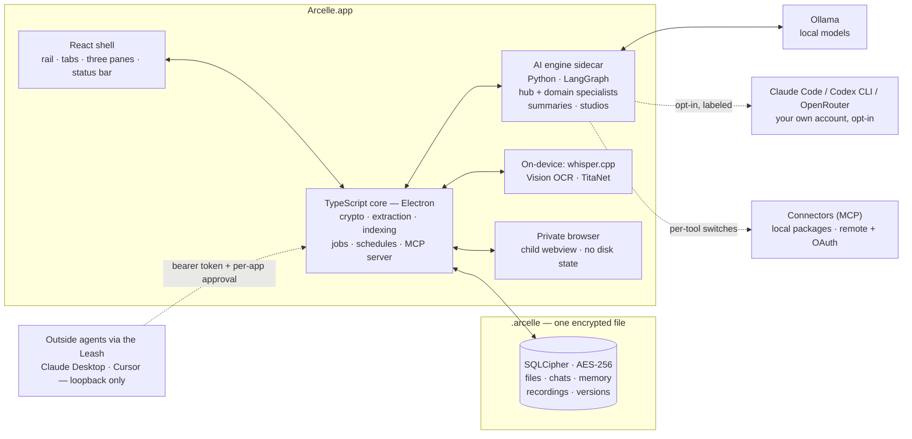

<a id="readme-top"></a>

<div align="center">

# Arcelle

**Using AI shouldn't require giving up your privacy.**

Every AI tool today asks the same trade: hand over your files and
conversations to a server you'll never see, and trust a privacy policy that
can change on their schedule, not yours. We think that's backwards — so we
built one that runs the other way around. The AI lives on your Mac, and
everything it touches — your files, your chats, its memory of you — is
sealed inside **one encrypted file** that only you hold the key to. Nothing
leaves your Mac unless you say so.

That's Arcelle: a private AI workspace that lives inside a single file.
Double-click it, unlock it with your password, and you're in.

[Download the latest Arcelle release](https://github.com/benrben/private-room/releases/latest)

[Download](#getting-started) ·
[Feature tour](#features) ·
[How it works](#how-it-works) ·
[Changelog](CHANGELOG.md) ·
[Report a bug](https://github.com/benrben/private-room/issues/new) ·
[Request a feature](https://github.com/benrben/private-room/issues/new)

</div>

---

<details>
<summary><b>Table of contents</b></summary>

- [About the project](#about-the-project)
  - [Why it's different](#why-its-different)
  - [Built with](#built-with)
- [Getting started](#getting-started)
  - [Prerequisites](#prerequisites)
  - [Install the app](#install-the-app)
  - [First run](#first-run)
  - [Staying up to date](#staying-up-to-date)
- [Features](#features)
  - [One shell, three panes](#one-shell-three-panes)
  - [What's in a room](#whats-in-a-room)
  - [The AI lives in the room](#the-ai-lives-in-the-room)
  - [Chat commands](#chat-commands)
  - [One room, any engine](#one-room-any-engine)
  - [Cloud privacy, mechanically enforced](#cloud-privacy-mechanically-enforced)
  - [The private browser](#the-private-browser)
  - [Automate the boring parts](#automate-the-boring-parts)
  - [Record the meeting, keep the proof](#record-the-meeting-keep-the-proof)
  - [Memory you can see](#memory-you-can-see)
  - [Files, viewers & organization](#files-viewers--organization)
  - [On-device by default](#on-device-by-default)
- [How it works](#how-it-works)
  - [Engineered for a 4B model](#engineered-for-a-4b-model)
- [Development](#development)
  - [Repository layout](#repository-layout)
  - [Tests](#tests)
  - [Design system](#design-system)
- [Roadmap](#roadmap)
- [Contributing](#contributing)
- [License](#license)
- [Contact & support](#contact--support)
- [Acknowledgments](#acknowledgments)

</details>

## About the project

Under the hood, an `.arcelle` file is an ordinary document. Everything you
put in a room — files, chat history, AI memory, recordings, and generated
documents — lives in **one SQLCipher-encrypted SQLite file**: copy it, back
it up, or AirDrop it like any other document; unlock it with your password
(or a fingerprint) and it opens like one, too. (Rooms made before the
Arcelle rename end in `.roomai`; those still open, and nothing needs
converting.) By default nothing leaves your computer: the AI runs locally
through Ollama — and if you *choose*
to point a room at a cloud engine, the app says so out loud, everywhere.

### Why it's different

A belief is only worth something if it's load-bearing, not a policy promise.
Here's where it actually shows up:

- 📍 **A local AI that can't fake a citation.** Every claim is pinned to the
  exact sentence in your document — and the app *verifies the quote before it
  shows it.* If the words aren't really there you get "≈ closest match" or
  nothing at all, never a confident invention. Each answer carries a 📍 chip
  that re-opens the highlight right in the file.
- 📤 **AirDrop your whole workspace as one file.** A room is a single document,
  so handing someone an entire encrypted workspace — files, chats, memory, and
  all — is one drop of one `.arcelle` file. Seal it and send it; nothing is left
  behind on a server.
- 🔐 **One encrypted file, no cloud.** The whole workspace is a single AES-256
  SQLCipher document. No account, no sync, no server. Your password is the key
  — no backdoor, no cloud reset. (When you create a room you can print a
  one-time recovery key to keep somewhere safe.)
- 🕶️ **Cloud models never see your private details.** If you do point a room
  at a cloud engine, a mechanical gatekeeper swaps protected details for
  neutral tags (`[Person A]`) before anything leaves — at every exit, with a
  per-file "Cloud view" showing exactly what the model would receive. See
  [Cloud privacy](#cloud-privacy-mechanically-enforced).
- 🔁 **It works while you don't.** Workflows chain AI steps into pipelines that
  run on a schedule; room scripts are real Python/JavaScript files that run
  against your files with explicit consent; studios turn sources into
  flashcards, mind maps, and podcasts you can cast with real voices and
  record as audio — all as cancellable background jobs.
- 🎙️ **It listens on-device.** Record your mic *and* the meeting's system
  audio, watch a live transcript build with speakers told apart automatically,
  and keep the whole thing — audio, transcript, speakers — inside the encrypted
  file.
- 🌐 **A browser that keeps nothing — and the AI can drive it.** A private
  browser with no history, no cookies, no cache and no saved logins — not
  "cleared on exit", never written to disk in the first place — with ads and
  trackers blocked before the request leaves your Mac. Ask the assistant to
  look something up and it opens the page itself, while every page, click and
  consent is journaled inside your encrypted room. See
  [The private browser](#the-private-browser).
- 🪶 **Tuned for a small model.** Built to be reliable on a 4B local model —
  constrained decoding, deterministic tool routing, and honest "I can't do
  that in place" behavior instead of confident nonsense. See
  [Engineered for a 4B model](#engineered-for-a-4b-model).

### Built with

| Layer | Technology |
|---|---|
| Shell | [Electron](https://www.electronjs.org/) · [React 19](https://react.dev) + TypeScript · [Vite](https://vite.dev) |
| Core | TypeScript — crypto, extraction orchestration, indexing, jobs, schedules, MCP server |
| AI engine | Python 3.13 + [LangGraph](https://langchain-ai.github.io/langgraph/), as a bundled localhost sidecar |
| Storage | [SQLCipher](https://www.zetetic.net/sqlcipher/) (AES-256) via `better-sqlite3-multiple-ciphers` |
| Models | [Ollama](https://ollama.com) · Ollama `:cloud` · Claude Code / Codex CLI · [OpenRouter](https://openrouter.ai) |
| On-device ML | [whisper.cpp](https://github.com/ggerganov/whisper.cpp) on Metal · Apple Vision OCR · TitaNet speaker embeddings via ONNX Runtime |
| Web | Electron `WebContentsView` (the private browser) · [Model Context Protocol](https://modelcontextprotocol.io) connectors |
| Viewers | PDF.js · docx-preview · SheetJS · Monaco |

<p align="right">(<a href="#readme-top">back to top</a>)</p>

## Getting started

### Prerequisites

- **macOS 12 or later, Apple Silicon.**
- **[Ollama](https://ollama.com)**, for the local AI engine:

  ```sh
  brew install ollama            # or download it from https://ollama.com
  ```

  Start Ollama before using a local model (opening the Ollama app is enough).
  Arcelle detects and uses the local service but does not take ownership of or
  terminate a daemon you started.

Dictation, transcription, and OCR need nothing extra: the Whisper voice model
is bundled inside the app.

### Install the app

1. **[⬇︎ Download the latest DMG](https://github.com/benrben/private-room/releases/latest)**,
   open it, and drag **Arcelle** into **Applications**.
2. This build is ad-hoc signed (**not notarized**), so the first time you open
   it macOS warns *"Apple could not verify 'Arcelle' is free of malware…"*
   That's expected for an un-notarized app — the full source is in this repo.
   Clear the download quarantine once, then open it normally:

   ```sh
   /usr/bin/xattr -cr "/Applications/Arcelle.app"
   ```

   (Use the full path `/usr/bin/xattr` — a Python `xattr` on your PATH has no
   `-r` flag.) Rather not use Terminal? Double-click the app, click **Done** on
   the warning, then **System Settings → Privacy & Security → Open Anyway**.

Prefer to build it yourself? See [Development](#development).

### First run

1. **Create a room.** Pick a password — it *is* the encryption key — and
   optionally print the one-time recovery key.
2. **Pick a model.** Arcelle shows a model picker on first launch; choose one
   (e.g. `qwen3.5:4b`, ~3.4 GB) and it downloads with a progress bar, no
   Terminal needed.
3. **Start from a template.** A new room can begin **Blank**, or as **Legal**,
   **Medical**, **Research**, **Journal**, or a guided **Demo** room with a
   couple of sample files to try highlighting and `#extract` on — each pre-fills
   tuned instructions, a few starter memories, and a welcome note. It's all
   ordinary, editable content; nothing is locked in.
4. **Drop files in and ask something.** Import is drag-and-drop; indexing runs
   in the background; answers arrive with citations you can click.

### Staying up to date

Arcelle checks its signed GitHub releases on launch and offers any newer build
in one click. You can also check on demand from **Settings → App → Updates &
version** — it downloads the release, verifies its signature, installs it, and
relaunches into the new version.

<p align="right">(<a href="#readme-top">back to top</a>)</p>

## Features

### One shell, three panes

The window is a persistent workspace, not a stack of screens. An activity rail
walks the room's areas — Home, Room Map, Recordings, Workflows, Scripts,
Skills, Memory, Connectors, and the private Browser, with Focus and Settings
pinned at the bottom — while the workspace splits into three draggable panes:
**Library** (your sources), **Workspace** (the current document), and **AI**
(Chat, Studio, and a live Activity feed). The rail collapses to an icon strip
or expands to full labels, and the choice sticks per room. A tab strip keeps
files, areas, and browser pages open side by side; file and area tabs are
restored with the room, while **browser tabs are deliberately never persisted**
— a restored list of visited URLs is a history file wearing a different hat.

A status bar always tells the truth: which engine is answering, whether it's
local or cloud, what's running in the background, and what's waiting for your
approval. `⌘K` is both room search and a command palette that runs real app
commands.

Dark is the default; a full light theme ships too, and every color in the app
flows through one token system so both are first-class.

### What's in a room

| | |
|---|---|
| **Files** | PDFs, Office docs, spreadsheets, Markdown, code, images, audio & video — stored as encrypted blobs, previewed with real viewers, organized into folders |
| **Chat** | Streaming conversations with the room's AI, grounded in your files; any reply can be saved back into the room as a new document |
| **Recordings** | Live meeting capture (mic + system audio) with real-time transcription and automatic speaker identification |
| **Workflows** | Visual multi-step AI pipelines with schedules, run history, and per-step artifacts |
| **Scripts** | Runnable Python/JavaScript files with declared inputs and outputs, schedulable like workflows |
| **Skills** | Folder-shaped `SKILL.md` bundles — reusable procedures the AI loads only when a task calls for them, with their own scripts, references, and assets |
| **Memory** | Everything the AI remembers about you — a full area with categories, approval flow, and a shared scratch pad |
| **Connectors** | MCP tool connectors, installed from a live registry or by hand, with per-tool switches and OAuth sign-in |
| **Browser** | A private browser that persists nothing, blocks ads and trackers, and the assistant can drive on your behalf |
| **Studio** | Flashcards, mind maps, and a living room summary, generated as background jobs — plus podcast scripts you can cast with real voices and record as audio |
| **Settings** | Per-room engine and model, creativity, custom instructions, role, Touch ID, dictation, online features, cloud privacy, and one-click app updates |

### The AI lives in the room

The model isn't a chat box bolted on the side — it can act on the room.

**It's a team, not one loop.** Chat is a hub: the Main agent holds no room
tools at all, only the ability to dispatch **specialists** — files, scripts,
web, browser, jobs, workflows, skills, connectors, transcription, video,
studio, and the UI. Each specialist is the same loop wearing a smaller toolbox
and a sharper prompt (~6 tools on top of a shared core), which is what keeps a
4B model from drowning in a catalog. Several can run **in parallel** in one
round, and the AI pane draws the live hub-and-spoke graph as they light up —
click any node to see what it was asked and what it reported back. A room that
lacks an ability (web off, for instance) simply has no such specialist, and
says so plainly instead of quietly handing the question to a different one.

- 👁️ **It can see.** Attach an image with the paperclip and ask about it.
  *"Where is X?"* draws labeled boxes on the image; grounding auto-routes to a
  Qwen-VL model when one is installed. Images are transcoded and downscaled
  before inference, so formats Ollama can't decode just work — and images
  never leave the Mac, even on a cloud engine.
- 🕹️ **It can drive the app.** Every specialist carries the same core verbs —
  `search_room`, `list_room_files`, `open_file` (jumps to a page, cell, or
  phrase), `annotate_file`, `mark_image`, `create_file`, `edit_file`,
  `edit_files`, `set_cells`, `rename_file`, `move_file`, and the memory verbs
  (`add_memory`, `update_memory`, `delete_memory`, so a wrong note it wrote
  isn't permanent) — so *"open the budget spreadsheet at Q3"*, *"mark the
  signature in this scan"*, or *"fix the typo in my notes"* actually happen in
  the UI.
- ✏️ **It can edit files — reliably.** Exact-text replacement with a
  normalization layer (curly quotes, NBSP, CRLF, dash variants) that tolerates
  cosmetic drift but still demands a unique match — a miss fails safely with a
  closest-snippet hint instead of editing the wrong place. The atomic
  `edit_files` tool validates a whole multi-file batch (including renames with
  reference updates) before writing any of it, undoable as a group. Prefer to
  look first? Flip on **ask before AI edits** and approve each batch from a
  side-by-side diff.
- 📍 **It can point at things.** `annotate_file` highlights an exact quote in
  PDFs, DOCX, and Markdown, or a cell range in spreadsheets. The model must
  quote verbatim — the app verifies it before marking (in any language,
  including pointed Hebrew against unpointed quotes), anchors to the closest
  match if it's slightly off, and each reply carries a 📍 chip that re-opens
  the highlight.
- 🌐 **It can browse.** Ask it to look something up and it opens the page in
  the private browser, reads it, clicks things, fills forms, and can look at
  the page as a picture with every clickable element numbered — the same
  numbers it uses when it describes them to you. Take over whenever you like;
  it says its tools are paused rather than pretending to act. See
  [The private browser](#the-private-browser).
- 🗣️ **It can speak.** Answers can be read aloud — per message or for every
  answer — through the room's voice archetypes. Voices are **neural synthetic
  voices, not human recordings**, synthesized by Microsoft's Edge TTS service
  at +22% rate / −2 Hz pitch and normalized to ≈−16 LUFS; only the sentence
  being spoken leaves the Mac, and only while speaking is on. The list is read
  live from the engine's own catalog (322 voices today), grouped by language
  with a Preview button, so it never goes stale — the default is Andrew
  (en-US, multilingual). There is no robotic on-device fallback any more:
  offline, a sentence is simply skipped.
- 📚 **It learns skills.** A skill is a folder-shaped `SKILL.md` bundle with
  optional `scripts/`, `references/`, and `assets/` — importable and exportable
  without being flattened. The assistant sees only enabled skill *names* and
  triggers up front, then reads the full instructions or one resource when the
  task actually calls for it. Imported and AI-drafted skills start disabled,
  and a skill's helper scripts run only after you review and approve their
  exact content.
- 🧠 **It remembers — with your approval.** Memory suggestions from
  conversations wait for a yes by default (or flow in automatically if you
  opt in), and everything it knows is visible and editable in the Memory area.
- 🔎 **It retrieves.** Imported files are chunked and indexed automatically in
  the background; the best excerpts travel with your question, and sources are
  shown on each answer. Keyword scoring works out of the box; **Settings →
  AI & behavior → AI helpers → Turn on semantic search** adds meaning-based
  retrieval — it downloads a small embedding model, re-indexes what's already
  in the room, and from then on both signals are fused (reciprocal rank), so a
  question finds the right paragraph even when it shares no words with it.
- 📊 **It shows you the bill.** A live token-budget bar under the composer
  shows how full the context window is, segmented by what's filling it —
  system prompt, history, tool results, skills, file reads — with exact counts
  behind a click. Running low? **Hand off** summarizes the conversation and
  continues the same chat on a fresh, much smaller context. Where the engine
  reports real usage the bar uses it; everywhere else it says it's estimating.

### Chat commands

Type `#` in the composer for quick, deterministic workflows — no coaxing the
model into the right shape:

| Command | What it does |
|---|---|
| `#add-file` | Write a new note or document — or one per item with "for each" |
| `#find` | Search the room's files and list what matches |
| `#highlight` | Mark an exact passage in a file so you can see it in the viewer |
| `#extract` | Pull the same fields out of several files into a spreadsheet |
| `#summarize` | Summarize the whole room, or one `@file` |
| `#compare` | Compare two or more `@files` side by side |
| `#to-sheet` | Turn the table in the last answer into a spreadsheet |
| `#transcribe` | Show the transcript of an `@recording` |
| `#minutes` | Turn a `@recording`'s transcript (or notes) into timeline-style HTML minutes |
| `#translate` | Translate an `@file` into another language |
| `#research` | Search the web, save each source into the room, then answer offline from those files |
| `#checkpoint` | Save a named checkpoint of the whole room (roll back later in Settings) |
| `#remember` | Save a fact to the room's permanent memory |

Every `#command` reads its **whole** source — a long book or a two-hour
transcript is walked window by window and merged, and if a window can't be
read the reply says so instead of quietly covering less.

### One room, any engine

A room picks its engine once, and **every** AI feature honors it — chat, the
agent, summaries, deep file passes, AI actions, studios, suggestions, and
workflow steps. No feature quietly falls back to a different brain.

- **Standard local AI** (recommended) — Ollama on your Mac. The app even runs
  the daemon for you: it starts Ollama on demand and stops it after five idle
  minutes, and never touches a daemon you started yourself.
- **Ollama `:cloud` models** — labeled as cloud everywhere they appear, never
  "local," and excluded when a feature explicitly needs on-device generation.
- **Claude Code / Codex CLI** — if the CLI is installed, it shows up as an
  engine. Pick the exact model and reasoning effort from the top-bar picker
  (Codex's model catalog is read live from the CLI). Your questions and room
  context go through *your own* CLI account — and the room's tools ride along
  over a per-question localhost MCP bridge, so the cloud model can search and
  edit room files while decryption stays in-process. The bridge dies when the
  answer returns.
- **OpenRouter** — paste an API key in Settings and it's validated and stored
  in the macOS **Keychain**, never in a room file. The model list is the live
  catalog for *your* account, with search, context windows, and current
  input/output pricing; filter it by capability (tool calling, vision,
  reasoning, structured JSON) and use the pick anywhere the room's engine is
  used. Same streaming, same room and MCP tools, same cloud-privacy door.

Four things intentionally stay on-device no matter the engine: dictation,
quick local generation, image grounding boxes, and the UI-driving tools.

### Cloud privacy, mechanically enforced

Choosing a cloud engine doesn't have to mean handing over your life. With
**Hide private details from cloud AI** on (per room, over a global default),
private details are swapped for stable neutral tags — `[Person A]`,
`[Address B]` — before anything reaches a cloud model, and put back in the
answer you read. The enforcement is **mechanical, not a prompt**: the same
redaction door sits at every exit — the AI engine gateway, Ollama `:cloud`
models, the Claude/Codex CLIs, and the MCP bridge outside agents use to read
room files. Images never leave while the door is on.

- **A local model builds the map.** Each imported file is scanned once,
  on-device, for names, addresses, phone numbers, health details — re-run
  automatically on import, transcription, and rule changes.
- **"Never share these" is a guarantee.** Exact words you add are blocked
  mechanically on every request — no AI judgment involved. Private topics in
  your own words ("my health") are the best-effort layer on top.
- **See it before you trust it.** Every file has a **Cloud view** toggle —
  the blocked version, blackouts included, exactly as a cloud model would
  receive it. Chat shows a green "N details hidden" receipt on protected
  turns, a loud red banner if privacy is off on a cloud engine, and a
  confirmed "Ask again with real details (this once)" valve when you need
  the model to see the real thing.
- **Honest limits, stated in-product.** Hiding names can't stop every
  inference from remaining context, and anything already sent to a cloud
  can't be recalled — the Settings page says so.

#### The Leash: let outside agents work in your room

Flip a switch and an unlocked room becomes a local MCP server that agents on
your Mac — Claude Code, Codex, Claude Desktop, Cursor — can connect to over
loopback with a bearer token. Choose **Files only** or **Full agent** (file
tools, background jobs, local generation, and media frames; UI control stays
excluded by design). Copy-paste config, per-app approval, and instant
revocation: regenerate the token or stop the server and live connections are
severed on the spot. Lock the room and their access dies with it.

#### Connectors: bring outside tools in

The Leash lets outside agents into your room; **Connectors** are the other
direction — outside tools brought to *your* room's AI. The Connectors area
installs MCP servers by hand or from the public Model Context Protocol registry,
with filters for verified publishers, local-only, and "no API key needed."
Browsing that registry is one of only two things Arcelle ever sends anywhere
without being asked — the other is the launch update check, which you can
switch off in Settings → Updates &amp; version — so it sits behind an explicit
opt-in; nothing about your room is sent, only the catalog comes back. A connector that ships both a local package and a hosted
endpoint installs the **local** one, with a one-tap switch to the cloud
version. Remote connectors are badged loudly, run their arguments through the
same redaction door before anything leaves the Mac, and can sign in with OAuth
(discovery, dynamic registration, and PKCE, through the system browser) without
leaving the app. Every connector — and every individual tool inside it — has
its own on/off switch, and installing from the marketplace goes through the
same approval and content-fingerprint gate as a hand-written config.

### The private browser

Browsing shouldn't leave a trail either. This is a full browser area inside
the room, built on a native child webview — so it renders exactly what
Safari renders and costs the app nothing extra in size.

- **It persists nothing.** No history, no cookies, no cache, no form data, no
  saved logins — the webview uses a non-persistent data store, so none of it is
  ever written to disk. The shield in the toolbar is a **live check of the
  browser's own storage**, not a label.
- **Ads and trackers die before the request leaves.** A content-blocking rule
  list is compiled into the webview, so blocked requests are never made.
- **It can't be a path to this Mac.** Every top-level navigation runs the same
  public-URL check the fetcher uses, and sub-resources are blocked at the
  network layer, so addresses on your own computer or home network are refused
  from the address bar and from inside a page alike. Password fields are fenced
  off from the assistant entirely.
- **Tabs, and a search page of its own.** Several pages at once; searching
  opens a results page built from the same fused multi-engine search, with
  previews, one-click save into the room, and an on-demand AI summary whose
  every claim links back to the result it came from.
- **Downloads through one guarded door.** Clicked downloads and assistant-side
  saves (a link, a file, a page's media) go through a single funnel — size
  capped, origin recorded, and tracked as a job you can watch — landing in the
  room as ordinary encrypted files.
- **The web forgets; your room remembers.** Every page, click, and consent from
  the *assistant* is written to a Journal inside the encrypted room, so you can
  read back exactly what happened — and clear it whenever you like.
- **Nothing of yours is typed into a page without you saying so.** If the
  assistant is about to enter text you marked private into a site, it stops and
  shows you the exact text and the exact site first.
- **Two switches, and they're yours.** Settings → Online features has the
  room's master internet switch, and under it two independent abilities for the
  AI: *search the web* and *use the private browser*. Turn either off and those
  tools aren't offered at all. The Browser area stays yours either way.

### Automate the boring parts

- **Workflows** chain steps into a pipeline on an animated canvas that lights
  up node by node as a run executes. Beyond the basics — generate, summarize,
  deep full-file pass, run the agent, save a file, condition branch — a step
  can run one of your **room scripts**, fetch a URL, extract structured fields
  into a table, transform text with **no model call at all**, **route** to
  different branches, **vote** across parallel attempts for consensus, **fan
  out over every matching file**, or loop to **refine an output until it
  passes** and **plan-then-map** an objective into sub-tasks. Independent
  branches run **in parallel** (lane-gated so the local model stays
  serialized). Start from a template (Morning digest, New-file summarizer,
  Weekly review, Deep read, Compare perspectives, Summarize every file, Triage
  the newest note), build by hand, or **describe the workflow in plain language
  and let the room's model draft it**. Runs keep step-by-step history and
  artifacts.
- **Schedules that survive a locked room.** Interval, daily, or weekly
  (DST-safe), with an optional catch-up run at unlock for triggers missed
  while the room was locked. Consent is collected once at activation, and a
  new trigger is skipped — not queued into a pile-up — if the previous run is
  still going.
- **Scripts** make Python and JavaScript files in your room runnable: a Run
  button in the file header, a Scripts area with status, schedule, and full
  run history including stdout/stderr. Each run executes in an isolated
  workspace, reads room files in and writes results back as versioned,
  undoable room files, and is gated by a first-run approval that must be
  re-granted if the script's content changes. Dependencies install themselves
  via `uv` — declared in a PEP-723 block, or detected and installed on the
  fly when a bare `import pandas` fails.
- **Studios run in the background.** Flashcards, mind maps, and podcast
  scripts enqueue as cancellable jobs, progress lives on the sidebar job card,
  and the finished page opens when it's ready. Jobs queue FIFO instead of
  refusing to start while another is running.
- **Podcasts you can listen to.** A podcast script isn't only a page to read.
  Open one and cast it: each host gets their own voice, speed and pitch, with
  a preview that reads one of *their* real lines rather than a generic sample.
  Record, and the episode is saved back into the room as audio — each host in
  their own voice — with a timed transcript you can click to jump to any
  moment. Re-cast and record again and the earlier episode is kept, under its
  own name. Recording speaks to an online voice service, so the panel says so
  before the button, not after.

### Record the meeting, keep the proof

Record your microphone plus the Mac's system audio (ScreenCaptureKit) and
watch the transcript build live as people speak — with speakers told apart
automatically by on-device TitaNet voice embeddings, color-coded chips per
speaker, live translation, and pause/resume. Afterwards, edit the recording by
editing its transcript, or re-transcribe old recordings with the current
pipeline. If the app dies mid-recording, checkpoints are spliced back together
the next time the room opens — nothing recorded is lost. Everything stays in
the encrypted file.

**Speakers split where the voice actually changes.** Most real conversation
puts two people inside a single spoken phrase, so labeling whole phrases
collapsed quick back-and-forth into one "Speaker 1". Audio is now re-examined
in 1.5-second steps and the transcript is cut at the voice change — on our
meeting test set that took speaker mix-ups from 17.9% to 1.3%. Phantom speakers
are gone too: a voice has to carry real speech mass before it counts as a
person, so a couple of seconds of laughter or overlap joins the nearest real
voice instead of minting a "Speaker 4". Those numbers come from an acceptance
harness that runs the shipping Python pipeline over meetings with RTTM ground
truth and fails when a row misses its diarization-error bar, so a regression is
caught rather than eyeballed. The focused checked-in speech suite runs with:

```sh
scripts/accuracy-tests.sh
```

### Memory you can see

Everything the AI remembers about you is a first-class area: browse, add,
edit, and delete memories grouped by category (Instructions, Preferences,
Projects, Facts), with suggestions from conversations waiting for your
approval unless you opt into auto-save. A pinned **scratch pad** is one click
away — a canonical, versioned room file that you and the AI both write, with a
reconcile banner instead of silent clobbering when you both edit at once.

### Files, viewers & organization

Imported files are stored as encrypted blobs and previewed with real viewers —
all bundled locally, no CDN, no network fetch.

| Format | Viewer / editing |
|---|---|
| PDF | PDF.js renderer — full documents of any length, lazily rendered, with quote highlighting |
| DOCX | docx-preview (run-aware AI edits keep formatting) |
| XLSX / CSV | SheetJS grid with sheet tabs; edit cells by A1 reference |
| Markdown / HTML | Rendered view with an edit toggle; generated docs are self-contained HTML in a sandboxed viewer |
| Code / text | Monaco editor — ⌘S saves back into the room and re-indexes |
| Images | Zoomable viewer with a "locate" bar for visual grounding |
| Audio / video | On-device transcript via the built-in Whisper engine |

- **Folders.** Group files into collapsible folders; drag to organize. Delete
  a folder and its files return to the top level — nothing is lost.
- **Many files at once.** Hold ⌘ to pick files one by one, Shift to take a
  run, ⌘A for everything on screen — then move, export, attach or trash the
  whole selection in a single step. Dragging any picked file drags all of
  them, and the Trash works the same way, so putting a dozen files back is one
  action. If part of a batch fails, Arcelle names the files that failed and
  finishes the rest, instead of reporting the whole thing as done.
- **Ask the AI to tidy up.** The file assistant can sort files into folders,
  rename them, merge two documents into one, and move clutter to the trash —
  in one pass, not one file at a time. For anything large, ask for the plan
  first: it can preview a whole reorganisation without touching a thing. It
  can trash, and that is as far as it goes — permanently deleting and emptying
  the trash stay yours alone. When it does trash something, the Trash tab says
  so and names the tool it used.
- **Version history & compare.** Every edit keeps the previous version with a
  cause and timestamp. Open any version in a side-by-side diff against the
  current text (RTL-aware for Hebrew/Arabic documents) and restore from
  there — byte-exact, even for binary `.xlsx`.
- **Import a link.** Paste a URL and Arcelle fetches the page once, saves
  a readable offline copy into the room, and the AI can answer from it with
  the web still off.
- **Export.** Export any file (byte-identical for originals) or the whole
  room; a one-time notice reminds you that copies leave the encrypted vault.

### On-device by default

Everything that touches your data runs on your Mac, using capabilities that
are already there.

- **Encryption.** Your password is the SQLCipher key (PBKDF2-derived
  internally). A wrong password can't read a single byte; there's no backdoor
  and no cloud reset — the only other way in is a recovery key you chose to
  print when you created the room. Changing your password re-wraps the
  recovery code (the old one stops working, and the app shows you the new
  one).
- **Touch ID unlock.** Opt in per room and unlock with a fingerprint. The
  password is sealed in the macOS Keychain behind a `biometryCurrentSet`
  access control — it never touches the room file or any plain file, and
  re-enrolling a finger invalidates it.
- **Checkpoints.** Snapshot the whole room — like a git commit for your
  `.arcelle` — and roll back to any of them. Rollback takes a "before
  rollback" safety copy first and refuses to run while jobs or recordings are
  in flight.
- **OCR for scans.** When a PDF or image has no extractable text, Apple's
  Vision framework recognizes it (English + Hebrew) entirely on-device.
  Visual-order Hebrew PDFs — the ones that extract as mirrored gibberish
  everywhere else — are detected and repaired at import, vowel points and
  all.
- **Dictation & transcription.** The bundled Python sidecar runs whisper.cpp
  on-device and the release DMG **ships the voice model**, so
  transcription works offline the moment you open it — no download.
- **Web is off until you ask.** No online tool is offered to the model — the
  browser's address bar refuses to load anything, and Add → Web link, the
  video import and the download-job button all refuse too — until you turn the
  internet on in **Settings → Online features**; then *search the web* and
  *use the private browser* are two separate switches under it. There's no key
  to paste and no provider to choose: search is built in, and one query fans
  out to seven independent engines at once, merged into a single relevance
  ranking so a blocked or rate-limited engine just drops out, with each hit
  carrying the engine that found it. Fetches run in the Electron main process behind a
  private-network guard (CGNAT, multicast, reserved ranges, and
  IPv4-mapped-IPv6 tricks included), responses are capped at 8 MB, arrive a
  bounded chunk at a time so one heavy page can't blow the model's context,
  and pages are cached in the room.
- **Honest privacy labels.** The status bar and engine picker always show
  what's local and what leaves the Mac; cloud is opt-in and labeled at the
  moment of choice, not buried in settings.

<p align="right">(<a href="#readme-top">back to top</a>)</p>

## How it works


```mermaid
flowchart LR
    subgraph file [".arcelle — one encrypted file"]
        DB[("SQLCipher · AES-256<br/>files · chats · memory<br/>recordings · versions")]
    end
    subgraph app ["Arcelle.app"]
        UI["React shell<br/>rail · tabs · three panes · status bar"]
        CORE["TypeScript core — Electron<br/>crypto · extraction · indexing<br/>jobs · schedules · MCP server"]
        AI["AI engine sidecar<br/>Python · LangGraph<br/>hub + domain specialists<br/>summaries · studios"]
        LOCAL["On-device: whisper.cpp<br/>Vision OCR · TitaNet"]
        WEB["Private browser<br/>child webview · no disk state"]
    end
    OLLAMA["Ollama<br/>local models"]
    CLIS["Claude Code / Codex CLI / OpenRouter<br/>your own account, opt-in"]
    MCP["Connectors (MCP)<br/>local packages · remote + OAuth"]
    AGENTS["Outside agents via the Leash<br/>Claude Desktop · Cursor — loopback only"]

    UI <--> CORE
    CORE <--> DB
    CORE <--> AI
    CORE <--> LOCAL
    CORE <--> WEB
    AI <--> OLLAMA
    AI -. "opt-in, labeled" .-> CLIS
    AI -. "per-tool switches" .-> MCP
    AGENTS -. "bearer token + per-app approval" .-> CORE
```

1. **Create / unlock** — your password is the SQLCipher key. A wrong password
   can't read a single byte.
2. **Import** — files are stored as encrypted blobs; readable text is
   extracted by the bundled sidecar, with on-device OCR / Whisper as
   fallbacks, then chunked and indexed automatically in the background.
3. **Ask** — your question is scored against every chunk in the room, the
   best excerpts are sent to the engine through the bundled AI sidecar, tools
   let it act on the room, and both sides of the chat are saved inside the
   file. One engine gateway serves every feature, so they all behave the
   same — and fail with the same honest errors.
4. **Generate** — any assistant reply can be saved back into the room, where
   it's indexed like any other file.

The sidecar binds to localhost only, never sees the room key, and is spawned,
health-checked, and shut down by the app. Its behavior is covered by 1,500+
tests across TypeScript and Python.

### Engineered for a 4B model

Arcelle targets a 4B local model on a 16 GB Mac — small enough to run
comfortably, small enough to wander. So judgment lives in deterministic code,
not in the model's good intentions:

- **Constrained decoding.** Grounding boxes, field extraction, room summaries,
  and file lists are produced with a JSON schema (`format`), so the output
  *can't* be malformed — and cloud models that wrap JSON in fences get their
  answers recovered automatically.
- **Deterministic tool routing.** A keyword router picks the smallest tool
  subset for each turn (file-mutating tools are withheld unless the ask calls
  for them), and the chosen "lane" is shown in the UI.
- **RAM-aware context.** The context window is capped small by default so a
  model that declares a 256K window can't OOM the machine; Macs with ≥32 GB
  get a larger window automatically.
- **Honest failure & teaching errors.** PDFs aren't faked as editable; a
  near-miss quote anchors to the closest match and says "≈ closest match"; a
  not-found file returns the actual file list so the next attempt lands.
- **Cache-stable prompts.** The system prompt is kept KV-cache-stable so warm
  replies stay fast.

<p align="right">(<a href="#readme-top">back to top</a>)</p>

## Development

Requires **Node**, [**uv**](https://docs.astral.sh/uv/) (builds and
runs the Python sidecar), and [**Ollama**](https://ollama.com). Pull a model
from inside the app (Settings → Model manager) or `ollama pull qwen3.5:4b`.

```sh
git clone https://github.com/benrben/private-room.git
cd private-room
npm install
npm run dev                  # run the Electron app + Vite renderer
npm run build                # compile renderer, preload, and main process
npm run clean:dry-run        # show generated files npm run clean will remove
npm run clean                # remove build/test output; keep deps and models
npm run package:dir          # unsigned local Arcelle.app proof
scripts/release.sh           # the DMG + signed updater payload come from here
```

Release builds bundle three on-device models (Whisper, TitaNet, Silero — 615 MB
together, none of them committed) — see [RELEASING.md](RELEASING.md) for the
one-time fetch, signing, and the full release pipeline.

### Repository layout

| Path | What's in it |
|---|---|
| [apps/desktop/](apps/desktop/) | Complete desktop app: main, preload, renderer, shared contracts, CLI, and packaging |
| [services/agent-sidecar/](services/agent-sidecar/) | Python + LangGraph AI engine (agents, workflows, studios) |
| [tests/](tests/) | Contract, Electron E2E, installed-app, visual, fixture, and manual regression coverage |
| [assets/brand/](assets/brand/README.md) | Master brand artwork and the asset-generation pipeline |
| [scripts/](scripts/) | Signing, release automation, and the release preflight |

### Tests

```sh
npm test                # Electron/TypeScript and Python sidecar suites

npm run test:electron   # Electron main process and backend TypeScript
npm run test:sidecar    # Python: the AI engine sidecar
npm run test:page       # renderer, source-boundary, and QA-mock contracts
npm run build           # TypeScript type-check + the production bundle
npm run e2e:qa          # UI regressions in Chrome against a mock backend
npm run build && node tests/support/make-qa.mjs && npm run preview
                        # → open /qa.html: full UI in a browser w/ mock IPC
```

Before a release, `npm run preflight` adds the checks a publish needs on top of
those suites — including version agreement and command-contract drift
(`scripts/preflight.sh --checks` runs the fast checks only). Nothing installs any of this as a git hook:
it runs when you run it, never behind your back. `npm run lint` also runs the
Python checks.

> **Notes.** Running pytest by hand inside `services/agent-sidecar/` needs `uv run pytest` —
> a bare `pytest` picks up the wrong environment. The counts above move with
> every wave of work; the suites are the source of truth, not this table.
>
> `npm run e2e` launches the compiled Electron app through Playwright and
> verifies the real renderer/preload boundary. `npm run e2e:qa` covers the
> broad visual state matrix against `tests/support/qa-mock.js`.
> `node tests/support/check-mock-coverage.mjs --bridge=electron` reports fixture coverage;
> registry and allowlist tests enforce complete command-contract coverage.
> Anything without a usable QA fixture is recorded on
> `window.__qaUnhandled` and shouted on the page itself, so a list that is
> empty because the *mock* has no data can never be mistaken for a real empty
> state. The one thing no harness can show is the browser's page: it is a
> native webview, so the Browser area renders its chrome, tabs, journal and
> search over an empty stage. See [tests/e2e/README.md](tests/e2e/README.md).

### Design system

The brand is a violet keyhole-doorway on ink — private, sealed, calm. Every
color in the app flows through CSS custom properties
([`apps/desktop/src/renderer/styles/tokens.css`](apps/desktop/src/renderer/styles/tokens.css)) with complete dark and
light palettes; the dark accents:

| Token | Hex | Role |
|---|---|---|
| Ink | `#121116` | Backgrounds |
| Panel | `#161a22` / `#1c212c` | Surfaces |
| Border | `#262d3b` | Strokes and dividers |
| Text / Slate | `#e8eaf0` / `#8b93a7` | Foreground / secondary |
| **Violet** | **`#8b7cf6`** | The accent — keyholes, glows, focus |
| Green / Amber / Red | `#4cc38a` / `#e3b341` / `#e5646c` | Status only |

In-app icons are React components in [`apps/desktop/src/renderer/icons.tsx`](apps/desktop/src/renderer/icons.tsx) and
[`apps/desktop/src/renderer/icons/shell.tsx`](apps/desktop/src/renderer/icons/shell.tsx) — one line-icon family (24px grid,
1.6px strokes, `currentColor`) used throughout, with **no native emoji**, so
the interface stays monochrome and consistent and the violet accent is reserved
for selected and primary actions. Master artwork and the asset-generation
pipeline live in [`assets/brand/`](assets/brand/README.md).

<p align="right">(<a href="#readme-top">back to top</a>)</p>

## Roadmap

Shipped since the first cut:

- [x] Touch ID unlock, link import, on-device OCR and Whisper transcription
- [x] Folders, version history, compare view, room checkpoints, room export
- [x] Room templates (Legal, Medical, Research, Journal)
- [x] Room-as-MCP-server for other AI tools, with per-app approval (the Leash)
- [x] Workflows, runnable room scripts, and background studios
- [x] Live meeting recording with speaker identification, split at the voice change
- [x] Engine parity: Ollama, `:cloud`, Claude Code, Codex CLI, and OpenRouter everywhere
- [x] Light theme, the three-pane shell, and workspace tabs
- [x] Cloud privacy: mechanical redaction at every exit, with a per-file Cloud view
- [x] Skills — portable `SKILL.md` bundles the AI loads only when needed
- [x] A connector marketplace for MCP tools, with OAuth sign-in
- [x] Built-in multi-engine web search (no key, no provider to pick)
- [x] The private browser, driveable by the assistant, with downloads and tabs
- [x] A hub of domain specialists that run in parallel, drawn live in the AI pane
- [x] The token-budget bar and one-click conversation handoff
- [x] Semantic search — an opt-in embedding model, fused with keyword scoring
- [x] Multi-file operations, and a file assistant that can organize the room
- [x] Podcasts with real voices — cast each host, record the episode as audio

Next:

- [ ] A vector index (sqlite-vec) — semantic search ships, but the vector pass
      still scans every chunk, which will not hold for very large rooms
- [ ] In-place `.xlsx` editing beyond single cells, and DOCX export
- [ ] Downloading a file that needs the site's own login (`startDownloadUsingRequest`)
      — clicked downloads already carry the session's cookies, so the gap is
      only "fetch an authed asset no link points at"
- [ ] **Save as PDF** from the browser (needs `WKPDFConfiguration`)
- [ ] Notarized releases (Developer ID)
- [ ] Windows port — a **rebuild, not a recompile**. Electron is portable;
      these are not, and each needs a Windows implementation written from
      scratch or a deliberate "not on Windows":
      recording the computer's own sound (ScreenCaptureKit),
      reading text from images (Apple Vision),
      the private browser (`WebContentsView`),
      the protected key store (Keychain),
      audio decoding and conversion (AVFoundation / `afconvert`),
      spoken output (the macOS neural voices),
      and the signing/notarization half of the release. Nothing is broken for
      Mac users today; this line is here so the size of the job is not a
      surprise.

See the [open issues](https://github.com/benrben/private-room/issues) for
everything else on the pile, and [CHANGELOG.md](CHANGELOG.md) for what shipped
when.

<p align="right">(<a href="#readme-top">back to top</a>)</p>

## Contributing

Bug reports, reproductions, and ideas are genuinely useful — please
[open an issue](https://github.com/benrben/private-room/issues/new). If you'd
like to send code:

1. Fork the repo and create a branch (`git checkout -b feature/thing`).
2. Make the change, and add a test next to the code you touched.
3. Keep every suite green — `npm test` runs Electron/TypeScript and Python;
   `npm run test:page` covers the browser and QA contracts.
4. Open a pull request describing the behavior change, not just the diff.

User-facing changes belong in [CHANGELOG.md](CHANGELOG.md), written the way
the rest of it is: what you can now do, in plain language.

<p align="right">(<a href="#readme-top">back to top</a>)</p>

## License

This repository does not carry an open-source license yet, so default
copyright applies: the source is published so you can read it, audit it, and
build the app for yourself. If you want to reuse any of it,
[ask first](https://github.com/benrben/private-room/issues/new) — happy to
talk.

<p align="right">(<a href="#readme-top">back to top</a>)</p>

## Contact & support

- **Bugs and feature requests:** [GitHub issues](https://github.com/benrben/private-room/issues)
- **Project:** [github.com/benrben/private-room](https://github.com/benrben/private-room)
- **Releases:** [latest DMG and release notes](https://github.com/benrben/private-room/releases)

Related docs: [RELEASING.md](RELEASING.md) (release pipeline),
[CHANGELOG.md](CHANGELOG.md) (what shipped when),
[tests/e2e/README.md](tests/e2e/README.md) (test suites),
[assets/brand/README.md](assets/brand/README.md) (brand assets).

<p align="right">(<a href="#readme-top">back to top</a>)</p>

## Acknowledgments

Arcelle stands on a lot of other people's work:

- [Electron](https://www.electronjs.org/) — the shell and isolated web contents
- [SQLCipher](https://www.zetetic.net/sqlcipher/) — encryption at rest
- [Ollama](https://ollama.com) — local model serving
- [LangGraph](https://langchain-ai.github.io/langgraph/) — the agent engine
- [whisper.cpp](https://github.com/ggerganov/whisper.cpp) — on-device speech-to-text
- [NVIDIA NeMo TitaNet](https://catalog.ngc.nvidia.com/models) and ONNX Runtime — speaker embeddings
- [PDF.js](https://mozilla.github.io/pdf.js/), [SheetJS](https://sheetjs.com), [docx-preview](https://github.com/VolodymyrBaydalka/docxjs), [Monaco](https://microsoft.github.io/monaco-editor/) — the viewers
- [Model Context Protocol](https://modelcontextprotocol.io) — the tool bridge in both directions

<p align="right">(<a href="#readme-top">back to top</a>)</p>
