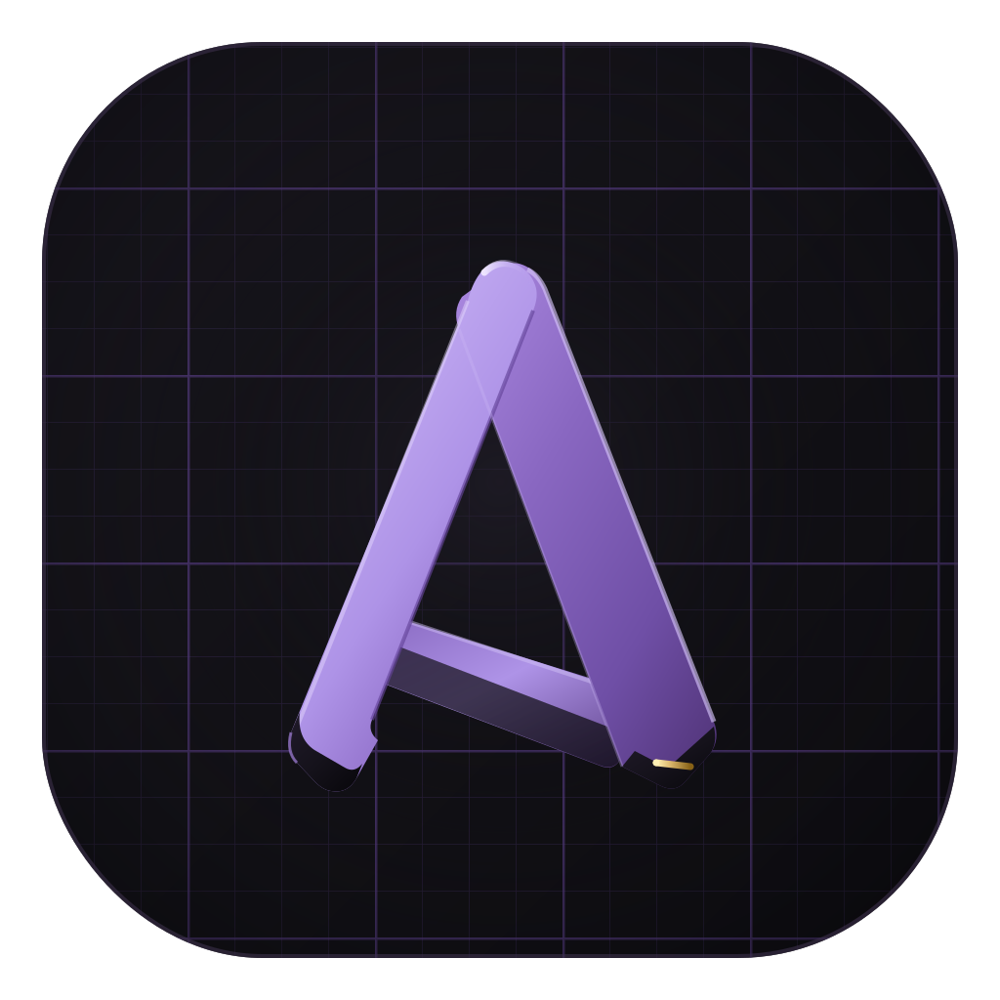

# Brand artwork sources

Master SVGs for every generated asset. The brand palette matches
`src/App.css`: ink `#0e1014`, panel `#161a22`/`#1c212c`, border `#262d3b`,
text `#e8eaf0`, slate `#8b93a7`, accent violet `#8b7cf6`. In-app icons live
as React components in `src/icons.tsx`; the favicon is `public/logo.svg`.

| Source | Generates | How |
|---|---|---|
| `appicon.svg` | `src-tauri/icons/*` (icns, ico, PNGs) | render to 1024px PNG, then `npx tauri icon <png>` |
| `docicon.svg` | `src-tauri/icons/document.icns` (.roomai Finder icon) | render sizes 16–1024 into an `.iconset`, then `iconutil -c icns` |
| `dmg-bg.svg` | `src-tauri/dmg-background.tiff` | render at 660×400 and 1320×800, then `tiffutil -cathidpicheck a.png b.png -out …` |
| `banner.svg` | `docs/banner.png` (README banner) | render at 2560×1280 |

`private-room-productivity-witness-protection.mp4` is the 74-second launch
video (1080p): "one job, seven apps" → product tour → the chaos enters
witness protection. Its end-card poster frame is `docs/video-poster.png`,
which the README links to the raw mp4; the video is also attached to GitHub
releases as an asset.

The README badge pills (`docs/badge-*.svg`) are hand-authored SVGs, not
generated — edit them directly, keeping the pill recipe: `#161a22` fill,
`#262d3b` stroke, 28px tall with `rx≈14`, a 4px status dot, slate `#8b93a7`
system-font text.

Render SVG → PNG with headless Chrome (no extra tooling needed):

```sh
"/Applications/Google Chrome.app/Contents/MacOS/Google Chrome" \
  --headless --disable-gpu --hide-scrollbars \
  --default-background-color=00000000 \
  --window-size=1024,1024 --screenshot=out.png \
  "file:///path/to/wrapper.html"   # html:  with zero body margin
```

The `.roomai` document icon is attached via `src-tauri/Info.plist`
(`CFBundleTypeIconFile` → `document.icns`, bundled through the
`bundle.resources` map in `tauri.conf.json`).
