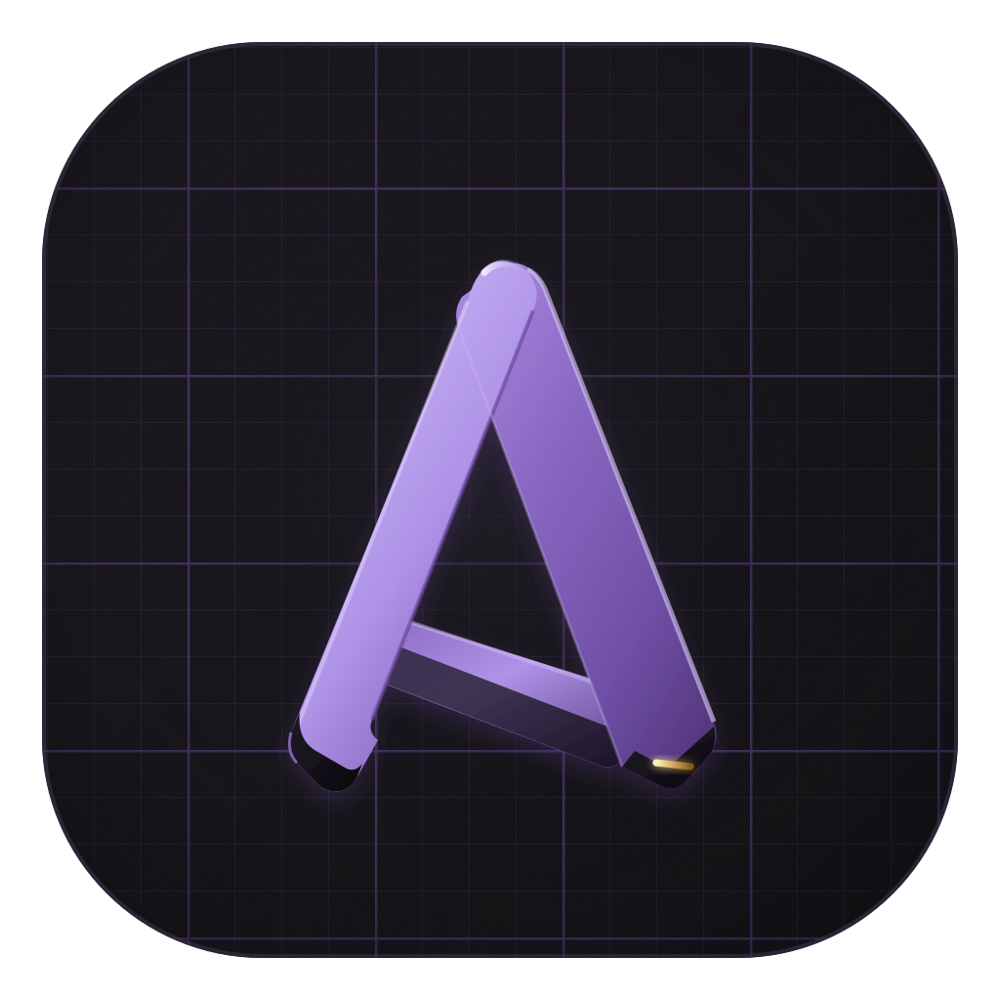

# Brand artwork sources

Master SVGs for every generated asset. The brand palette matches
`apps/desktop/src/renderer/App.css`: ink `#0e1014`, panel `#161a22`/`#1c212c`, border `#262d3b`,
text `#e8eaf0`, slate `#8b93a7`, accent violet `#8b7cf6`. In-app icons live
as React components in `apps/desktop/src/renderer/icons.tsx`; the favicon is `apps/desktop/public/logo.svg`.

| Source | Generates | How |
|---|---|---|
| `appicon.svg` | `apps/desktop/resources/icons/icon.icns` | render sizes 16–1024 into an `.iconset`, then `iconutil -c icns` |
| `docicon.svg` | `apps/desktop/resources/icons/document.icns` (Finder document icon) | render sizes 16–1024 into an `.iconset`, then `iconutil -c icns` |
| `dmg-bg.svg` | Release DMG background artwork | render at 660×400 and 1320×800, then `tiffutil -cathidpicheck a.png b.png -out …` |
| `banner.svg` | Optional repository banner artwork | render at 2560×1280 |

> `docicon.svg` is currently a byte-for-byte copy of `appicon.svg`, so
> `document.icns` and `icon.icns` are the same file — a document in Finder
> looks exactly like the app. That's a placeholder, not a decision: give
> `docicon.svg` its own artwork (a page behind the keyhole reads better at
> 16px) and re-run the `iconutil` step above. Git stores the two `.icns` as
> one blob while they're identical.

Large promotional media belongs on the GitHub release rather than in the
repository. Keep this directory to the vector masters needed to regenerate
application, document, installer, and optional repository artwork.

Render SVG → PNG with headless Chrome (no extra tooling needed):

```sh
"/Applications/Google Chrome.app/Contents/MacOS/Google Chrome" \
  --headless --disable-gpu --hide-scrollbars \
  --default-background-color=00000000 \
  --window-size=1024,1024 --screenshot=out.png \
  "file:///path/to/wrapper.html"   # html:  with zero body margin
```

The `.arcelle`/`.roomai` document icon is attached by
`apps/desktop/electron-builder.config.mjs`
(`CFBundleTypeIconFile` → `document.icns`) and bundled through
electron-builder's `extraResources` configuration.
